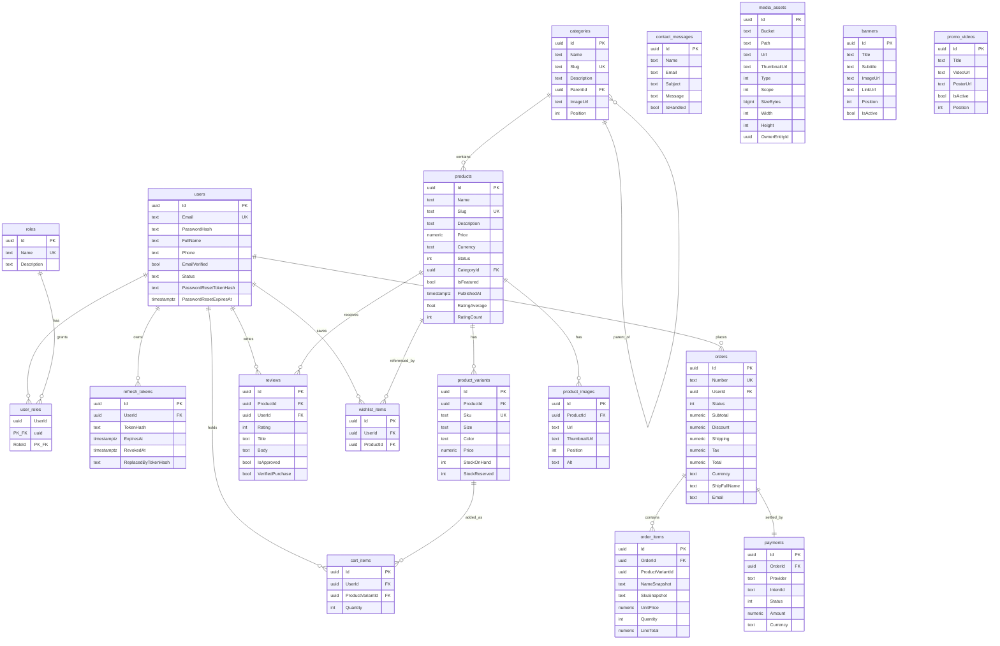

# DRIP Syndicate — Entity Relationship Diagram

The schema is PostgreSQL (Supabase). Tables use `snake_case` names; columns are
`PascalCase` (matching the EF Core entities). Every table inherits the audit
columns `Id (uuid, pk)`, `CreatedAt`, `UpdatedAt`, and `DeletedAt` (soft delete)
from `BaseEntity`, except the pure join table `user_roles`.

## Notes & invariants

- **Soft deletes.** A global EF query filter excludes rows where `DeletedAt`
  is not null; deletes set the timestamp instead of removing the row.
- **No oversell.** `product_variants` carries a `CHECK ("StockOnHand" -
  "StockReserved" >= 0)` constraint (`ck_no_oversell`). Checkout decrements
  stock inside a transaction so the database refuses to go negative.
- **`order_items.ProductVariantId`** is stored as a plain `uuid` with **no FK**
  on purpose: line items are immutable snapshots and must survive a variant
  being deleted. `NameSnapshot` / `SkuSnapshot` / `UnitPrice` freeze the sale.
- **Tokens are hashed.** `refresh_tokens.TokenHash` and
  `users.PasswordResetTokenHash` store SHA-256 hashes, never raw secrets.
- **Unique indexes:** `users.Email`, `roles.Name`, `categories.Slug`,
  `products.Slug`, `product_variants.Sku`, `orders.Number`,
  `(user_id, product_variant_id)` on `cart_items`,
  `(user_id, product_id)` on `wishlist_items`.
